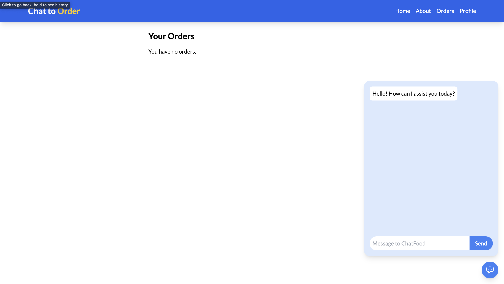
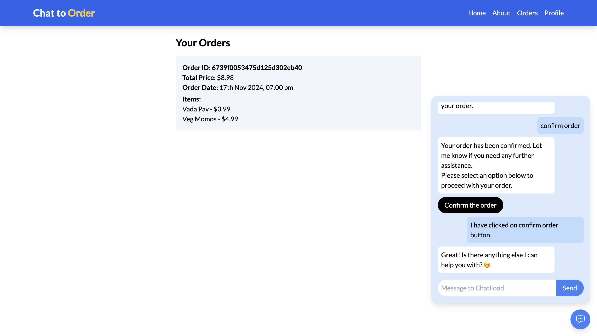
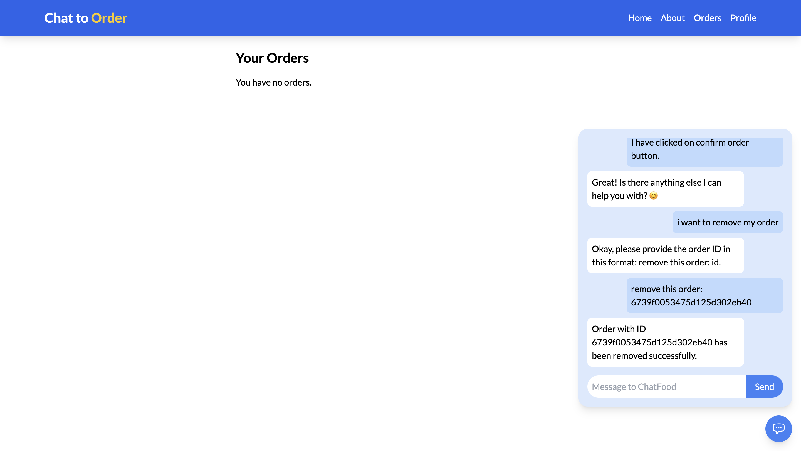
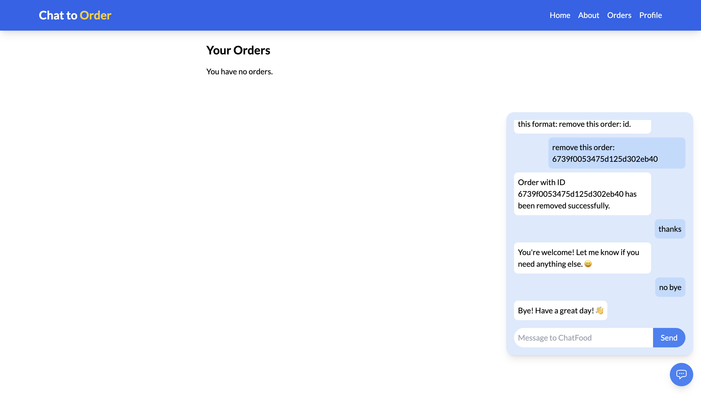

# **Chat-to-Order: GenAI-NLP-Flask-React**

## **Previews**

---

## **About the Project**

Chat-to-Order is a unique web application where users can order food simply by chatting with an AI-powered assistant. This project combines Natural Language Processing (NLP) and conversational AI to deliver an intuitive, engaging user experience. 

---

### **The Story Behind the Project**

- **Inception**: When I started this project, I had no clear roadmap or experience in building such a web app. I had learned about RAG apps, but I realized that wouldn't be enough for the complex requirements of this project.

- **Learning Journey**:
  - I decided to implement two key NLP models:
    1. **Intent Detection Model**: Built using BERT, fine-tuned for text classification to detect user intents like creating an order, removing an order, or having no intent.
    2. **Named Entity Recognition (NER) Model**: Leveraging spaCy to identify food items mentioned in user chats.

  - Initially, I had no idea how to build these models. Through extensive research—reading Kaggle notebooks and Medium blogs—I gained clarity and successfully trained, tested, and integrated the models into my project.

- **Tech Stack**:
  - **Frontend**: Developed with React.js for a clean, interactive UI.
  - **Backend**: Flask served as the backbone for API handling and processing.
  - **Database**: MongoDB was used for managing user and order data.

---

### **How the System Works**

1. **Chat Interaction**:
   - The user chats with the AI assistant.
   - Each user message triggers the **Intent Detection Model** to determine the user's intent:
     - **Create Order**: Start building an order.
     - **Remove Order**: Modify or cancel items from the order.
     - **No Intent**: Maintain the flow of conversation.

2. **Order Creation**:
   - When the intent is "Create Order," the **NER Model** extracts food names from the chat.
   - The system fetches details of these items from the database and generates an order summary.

3. **Order Removal**:
   - Regex-based logic is used to identify and remove items from the order.

4. **Dynamic Updates**:
   - UI changes dynamically based on user actions.
   - The database is updated in real time for order creation and management.

---

### **Challenges and Achievements**
- **Challenges**:
  - Understanding and implementing NLP models from scratch.
  - Seamlessly integrating the chat models with UI and backend logic.

- **Achievements**:
  - Built two functional NLP models (BERT for intent detection and spaCy for NER).
  - Created a complete web app with authentication and a visually appealing interface.

---

### **Why This Project Matters**
Although this project is not deployed, it demonstrates:
- Proficiency in integrating NLP with web development.
- Problem-solving skills in designing dynamic interactions between user input and AI logic.

---

### **Future Plans**
- Deploy a production-ready version in collaboration with a full food-ordering platform.
- Explore new user-centric features for real-world applications.

---

If you’ve made it this far, I’d love to hear your thoughts on my approach. Your feedback will help refine my ideas for future projects!